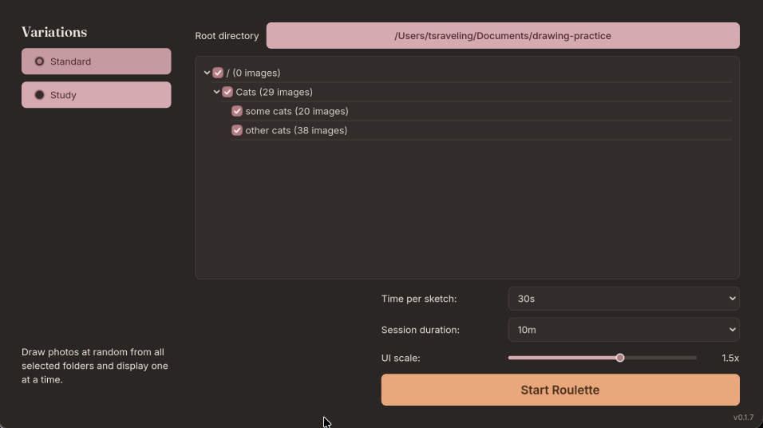

# art-roulette

Run drawing exercises from your own personal reference libraries. Set session length, drawing length, and pick a folder (can optionally include subfolders as well) on your computer, click start, and start drawing!



## Installation

To start with, download the zip for your platform from the [latest release](../../releases)!

NOTE: I have not yet bothered with provisioning this software -- sorry for the extra security dance! I promise that I won't steal your identity, and that even if I did, I would only do ethical crimes with it.

### Windows

1. Download `ArtRoulette-Windows.zip` and extract it.
2. Run `ArtRoulette.exe`.
3. Windows SmartScreen may warn about an unrecognized app. Click **More info** → **Run anyway**.

### macOS

1. Download `ArtRoulette-macOS.zip` and double-click it to unpack. You'll get an app called `ArtRoulette`.
2. Drag `ArtRoulette` into your **Applications** folder
3. Double-click the app to open it. The first time, your Mac will show a warning saying it can't verify the app. Close the warning, then:
   1. Open **System Settings** and click **Privacy & Security** in the left sidebar.
   2. Scroll down until you see a message about ArtRoulette being blocked, and click **Open Anyway**.
   3. Confirm with your password or Touch ID when asked.
4. The app opens. You only have to do this once — after that it opens normally.

On older Macs (macOS 14 or earlier) there's a shortcut: instead of steps 3–4, right-click (or hold Control and click) the app, choose **Open**, then click **Open** again in the warning.

#### For technical users

Skip all of the above by clearing the quarantine flag in a terminal:

```sh
xattr -cr /path/to/ArtRoulette.app
```

### Linux

1. Download `ArtRoulette-Linux.zip` and extract it.
2. Make the binary executable if needed, then run it:
   ```sh
   chmod +x ArtRoulette.x86_64
   ./ArtRoulette.x86_64
   ```
